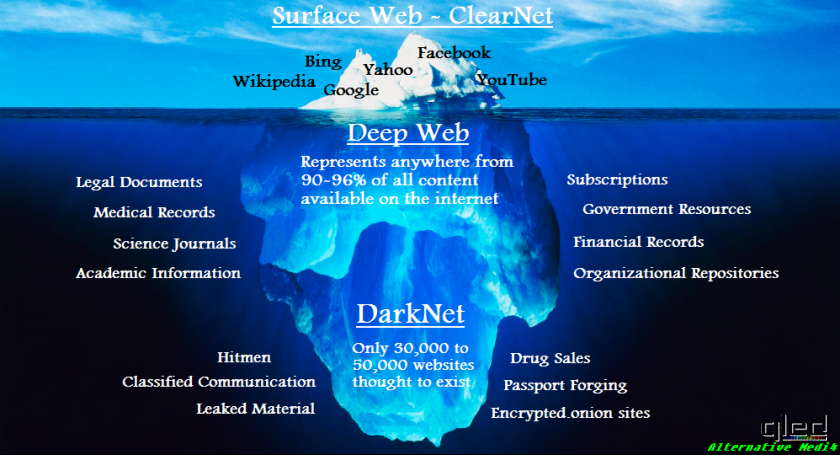

# DarkSearch
#### Hi today we will talk a little about the dark internet.

  
 

#### Only the dark internet is very dangerous and should not be visited.
---
## DarkInternet
#### you can look at the picture.

#### In the photo you can see the scale of the Internet.
---
## DarkSearch url

#### Here is a link to darksearch this site can get any information from the depths of the Internet.

https://darksearch.io/api/search
#### I don't tap the url.
